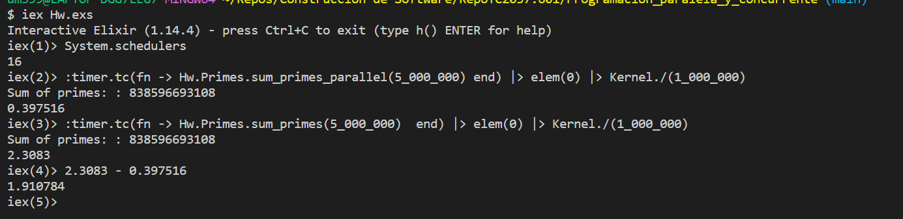
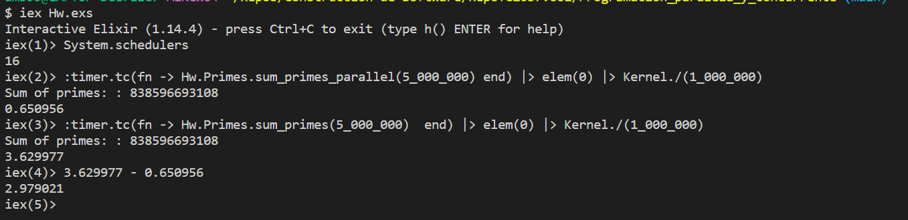
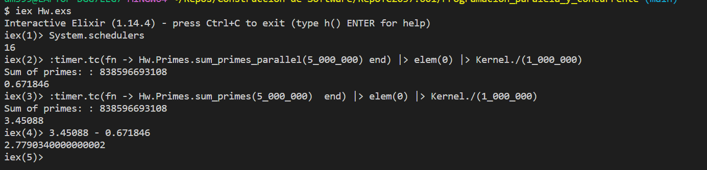
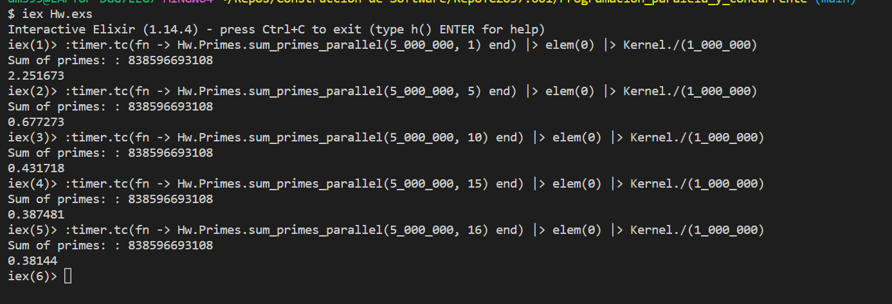

# Actividad 5.2 Programación paralela y concurrente

In this activity we can show the different process that takes into place while building code in a recursive and parallel way, compared to only recursive and secuencial way. We are mainly focusing on the time difference that this two type of procedures produce.

A thing to take into mind is that the secuencial method was improved since it would be just not as note worthy if we propusely make the code to run slow, so we are basically comparing the best we can make with the best we can improve parallely. 

## Table of Contents

- [Actividad 5.2 Programación paralela y concurrente](#actividad-52-programación-paralela-y-concurrente)
  - [Table of Contents](#table-of-contents)
  - [How to run the code](#how-to-run-the-code)
  - [Time Analysis](#time-analysis)
    - [Test #1](#test-1)
    - [Test #2](#test-2)
    - [Test #3](#test-3)
    - [Test #4](#test-4)

## How to run the code

The way to run this code, is to open terminal and be inside the "RepoTC2037.601\Programacion_paralela_y_concurrente" folder.

Next is to run the "Hw.exs" file with the command: 'iex Hw.exs'. Of course you need to have Erlang and Elixir installed.

Next is to run the specific command to see the different ways to approach the task:

To see the **secuencial approach** run the code: :timer.tc(fn -> Hw.Primes.sum_primes(5_000_000)  end) |> elem(0) |> Kernel./(1_000_000)

To see the **parallel approach** run the code: :timer.tc(fn -> Hw.Primes.sum_primes_parallel(5_000_000) end) |> elem(0) |> Kernel./(1_000_000)

## Time Analysis

<!--  -->

### Test #1

### Test #2

### Test #3

As we can see in the images provided before, there are three tests that take the same parameters to observe any anomalies not taken into account while the functions were being processed. 

As we can see, the secuencial approach takes an average of 2.556279666 seconds more to compleate the task than with the parallel approach.

A thing to take into mind is that the parallel approach form the tests above is working with 16 cores to achieve the task. But if we want, we can also indicate the cores to use and the prime starting number in the sum_primes_parallel/3 function.

### Test #4

Finally, we can observe from the test #4 that while increasing the number of cores to work with, the time that it takes the program to finish diminishes.