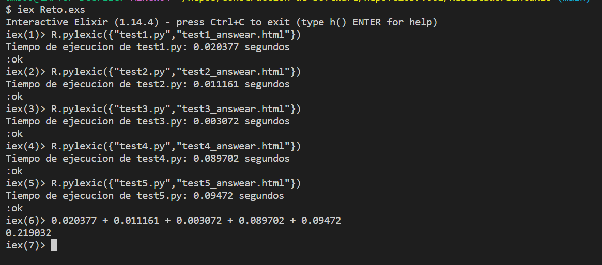
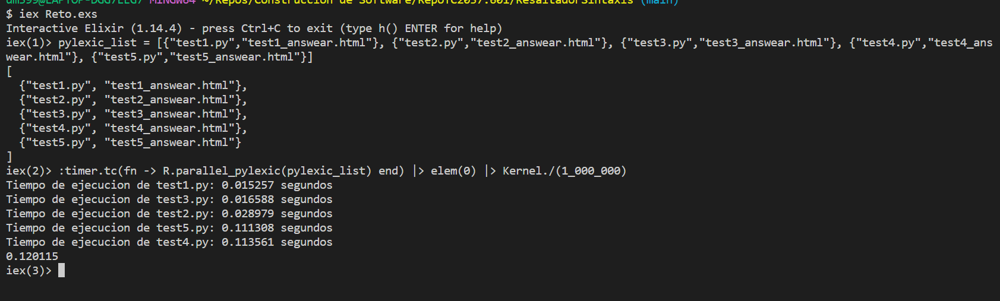

# Syntax Highlighter of a Python program, normal and parallel version
### Authors
- David Medina Domínguez (A01783155)
- Angel Afonso Castellanos (A01782545)

## Summary
In this activity we can observe how to highlight the syntax of code from the language of Python. We use pattern matching, regex, recursion and parallelism throughout the program. We also present two versions of the same highlight highliter, one that uses simple regex, pattern matching and recursion, and the other that simply adds to the code to make it parallel while analyzing other files to make them simoultaniously.

## Table of Contents

- [Syntax Highlighter of a Python program, normal and parallel version](#syntax-highlighter-of-a-python-program-normal-and-parallel-version)
    - [Authors](#authors)
  - [Summary](#summary)
  - [Table of Contents](#table-of-contents)
  - [Manual de Usuario](#manual-de-usuario)
  - [Time Analysis](#time-analysis)
    - [Test #1 Secuencial version](#test-1-secuencial-version)
    - [Test #2 Parallel version](#test-2-parallel-version)
  - [Complexity Analysis](#complexity-analysis)
  - [Ethical Implications](#ethical-implications)


## Manual de Usuario

To run this code, you need the following elements installed:

* Erlang
* Elixir

Then we need to be and have the the scripts that are within this folder, which are going to be used to highlight the contents within.

Then we run the following command to access the functions that will apply the Syntax Highlighter:

```{terminal}
    iex Reto.exs
```
Then we can run the normal Syntax Highlighter with the following code, which will require two things, first we need to put the name of the file that contains the python code, and then we just need to put the name of the out file html that will contain and show the code highlighted within a web page. The colors and patters can be found and modified in the tests.css file.

The module name is just 'R' and the first function is called 'pylexic/2', just as follows: 

```{elixir}
    iex(1)> R.pylexic("test1.py","test1_answear.html")
```

And the other parallel version, called  can be run by just adding a list of tuples that will contain both the name and out file name of the program, just as follows:

```{elixir}
    iex(1)> pylexic_list = [{"test1.py","test1_answear.html"}, {"test2.py","test2_answear.html"}, {"test3.py","test3_answear.html"}, {"test4.py","test4_answear.html"}]
    iex(2)> R.parallel_pylexic(pylexic_list)
```

or, to see the time:
```{elixir}
iex(2)>  :timer.tc(fn -> R.parallel_pylexic(pylexic_list) end) |> elem(0) |> Kernel./(1_000_000)
```


## Time Analysis

### Test #1 Secuencial version

<div style="text-align: center;">

</div>

### Test #2 Parallel version

<div style="text-align: center;">

</div>

As we can see in the images above, the second parallel approach actually took almost half the time. The same 5 files were processed at the same time.

## Complexity Analysis

We can determine that the complexity of this code is the same for both the Secuencial and Parallel approach due to the fact that they are bein processed at the same time, for the exception that if the user enters a list of tuples bigger than the cores of his/her computer has.

But both have a complexity of O(n), which is the number of lines and elements within each line of code. I personally would think that it is just a bit worse than an O(n), since it has a recursion for every n line of code, so it seems like a nested loop, but in reallity it is a recursion within a loop. But then again, it needs to go through that recursion anyway.

## Ethical Implications

I think this kind of power and implementation is really powerful and it is indeed the future, ever since the computer was upgraded to manage different tasks at the "same" time, I say "same" like that because in reallity it just takes turns, we really needed more power and ingenuity to handle bigger tasks and information. But now that computers have more cores, the time in which heavy tasks are completed is greatly reduced.
